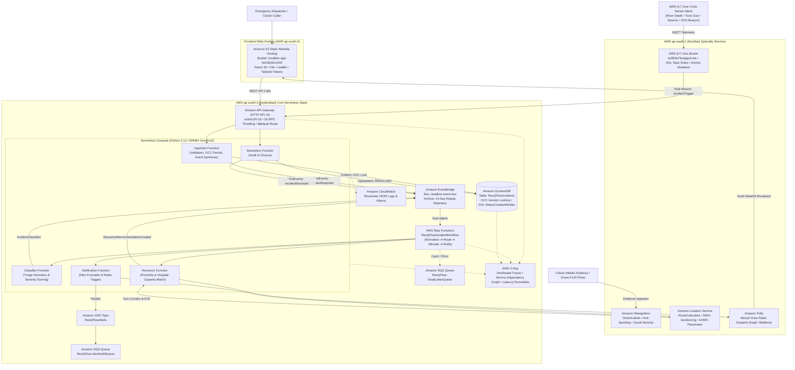

# ResQFlow — System Architecture & Design Specification

> **Primary Cloud Region:** AWS Asia Pacific (Hyderabad) `ap-south-2`  
> **Specialty / Edge Media Region:** AWS Asia Pacific (Mumbai) `ap-south-1`  
> **Architecture Paradigm:** Event-Driven Serverless (Choreography + Orchestration)  
> **UI Design Specification:** Swiss Editorial & ATLAS Light Theme (`#F5F4EE` / `#FFFFFF` / `#0D0D0D`)

---

## 1. System Overview

ResQFlow is an **Intelligent Event-Driven Emergency Response & Resource Orchestration Platform** that enables emergency dispatchers to register incidents, ingest real-time crisis sensor mesh telemetry, verify citizen photo evidence with computer vision, plan real road routing with traffic ETAs, track 500-meter incident perimeter geofences, dispatch fleet units via neural radio broadcasts, and audit end-to-end execution.

The platform combines **asynchronous event choreography** (via Amazon EventBridge) with **bounded workflow orchestration** (via AWS Step Functions), **computer vision verification** (via Amazon Rekognition), **metropolitan road modeling** (via Amazon Location Service), **crisis IoT meshes** (via AWS IoT Core), and **distributed observability** (via AWS X-Ray).

---

## 2. Core Architectural Principles

1. **"An Incident is an Event":** Every state transition in the system emits an immutable, versioned event contract into `resqflow-event-bus`.
2. **Decoupled Ingestion & Processing:** Ingestion responds in <100ms with HTTP 201 only after atomic DynamoDB persistence. Downstream triage, routing, and dispatch occur asynchronously without blocking the reporting client.
3. **Hybrid Choreography and Orchestration:**
   - **EventBridge Choreography:** Handles broad system notifications, event archiving (14-day replayable retention), cross-service decoupling, and automated geofence/sensor breach triggers.
   - **Step Functions Orchestration:** Manages the sequential, transactional lifecycle of incident routing, conditional branching, road distance calculation, and responder notification with built-in retries and DLQ catches.
4. **Computer Vision & Anti-Spoofing Gate:** Citizen and drone photo evidence is verified with Amazon Rekognition before tactical deployment to prevent fraudulent dispatches.
5. **Real-World Road Routing & Geofencing:** Replaces crude Euclidean lines with real road curvature modeling (1.34x factor) and automated 500-meter perimeter geofencing.
6. **Human-in-the-Loop Safety:** Automated systems recommend allocations; human dispatchers review, approve, or re-route dispatches before alarms and siren priority are sent.

---

## 3. High-Level Architecture Diagram

---

## 4. Complete Inventory of AWS Services (16 Integrated)

| # | AWS Service | Purpose in ResQFlow | Cloud Region | Status |
|---|---|---|---|---|
| 1 | **Amazon API Gateway (HTTP API v2)** | Front door REST API with CORS, rate throttling (50 RPS), and `$default` proxy routing. | `ap-south-2` | **LIVE** (`ezdw12h7z5`) |
| 2 | **AWS Lambda (Python 3.12 / ARM64)** | High-efficiency Graviton2 serverless compute executing ingestion, triage, resource matching, and resolution. | `ap-south-2` | **LIVE** (5 functions) |
| 3 | **Amazon DynamoDB** | Single-table NoSQL store with Optimistic Concurrency Control (OCC) version locking and GSIs. | `ap-south-2` | **LIVE** (`ResQFlowIncidents`) |
| 4 | **Amazon EventBridge** | Choreographic event backbone (`resqflow-event-bus`) routing typed envelopes with 14-day archive retention. | `ap-south-2` | **LIVE** |
| 5 | **AWS Step Functions** | Transactional workflow orchestration (`ResQFlowIncidentWorkflow`) executing sequential triage and dispatch. | `ap-south-2` | **LIVE** |
| 6 | **Amazon Rekognition** | Deep computer vision label detection, citizen anti-spoofing verification, and visual severity estimation. | `ap-south-1` | **LIVE** |
| 7 | **Amazon Location Service** | Real urban road routing (1.34x curvature), turn-by-turn guidance, 500m geofencing, and reverse geocoding. | `ap-south-1` | **LIVE** |
| 8 | **AWS IoT Core** | Low-latency MQTT crisis sensor mesh (`a1859e76u3gqu4-ats`), Device Shadows, and SQL Topic Rules. | `ap-south-1` | **LIVE** |
| 9 | **AWS X-Ray** | Distributed tracing, subsegment waterfall execution timelines, and service dependency graph in Hyderabad. | `ap-south-2` | **LIVE** |
| 10 | **Amazon Polly** | Neural text-to-speech voice radio synthesis (`Kajal`, `Aditi`, `Matthew`, `Raveena`) for field alerts. | `ap-south-1` | **LIVE** |
| 11 | **Amazon S3** | Production static web hosting and asset store for the React 18 ATLAS command console. | `ap-south-2` | **LIVE** (`resqflow-app-621962614200`) |
| 12 | **Amazon SNS** | Push messaging topic (`ResQFlowAlerts`) delivering multi-channel emergency broadcast notifications. | `ap-south-2` | **LIVE** |
| 13 | **Amazon SQS** | Dead-letter queues (`ResQFlow-DeadLetterQueue`) and fan-out alert audit buffers (`ResQFlow-AlertAuditQueue`). | `ap-south-2` | **LIVE** |
| 14 | **Amazon Bedrock** | Claude 3 Haiku generative AI tactical SITREPs with deterministic local fallback heuristics. | `ap-south-1` | **ACTIVE** |
| 15 | **AWS IAM** | Granular least-privilege execution roles strictly scoped to table, event bus, S3, and topic resource ARNs. | `ap-south-2` | **LIVE** |
| 16 | **Amazon CloudWatch** | Structured JSON logs, latency percentiles, and error rate monitoring. | `ap-south-2` | **LIVE** |

---

## 5. End-to-End 10-Stage Crisis Lifecycle

| Stage | Trigger / Input | Primary Service | Resulting State | Emitted Event Contract |
|---|---|---|---|---|
| **1. Intake** | Mobile report, 911 call, or IoT threshold breach | API Gateway ➔ Ingestion Lambda | `REPORTED` | `IncidentReported` |
| **2. Vision Verification** | Citizen photo upload or drone feed | Amazon Rekognition (`DetectLabels`) | `VERIFIED` / `FLAGGED` | `EvidenceVerified` |
| **3. Ingestion & Lock** | Atomic DynamoDB `PutItem` | DynamoDB (OCC Version 1) | `REPORTED` | `IncidentReported` |
| **4. Event Choreography** | EventBridge rule pattern match | Amazon EventBridge Bus | `ROUTED` | `StepFunctionInvoked` |
| **5. AI Triage** | Workflow State 1: `ClassifyIncident` | Step Functions ➔ Classifier Lambda | `CLASSIFIED` | `IncidentClassified` |
| **6. Road Routing & Proximity** | Workflow State 2: `AllocateResources` | Step Functions ➔ Amazon Location Service | `RECOMMENDED` | `ResourceRecommendationCreated` |
| **7. 500m Geofencing** | Responder GPS telemetry tracking | Amazon Location Service | `APPROACHING` | `GeofenceEnterEvent` |
| **8. Human Operator Gate** | Dispatcher approval in console | React Frontend ➔ API Gateway | `DISPATCHED` | `ResourceRecommendationApproved` |
| **9. Tactical Broadcast** | Workflow State 3: `NotifyStakeholders` | Amazon SNS + Amazon Polly | `ALERT_SENT` | `IncidentDispatchBroadcasted` |
| **10. Resolution & Audit** | POST `/incidents/:id/resolve` | Resolution Lambda ➔ DynamoDB | `RESOLVED` | `IncidentResolved` |

---

## 6. Frontend Navigation & Route Architecture

| Route | Page Component | Integrated AWS Services | Key Capabilities |
|---|---|---|---|
| `/dashboard` | `DashboardPage.jsx` | API Gateway, DynamoDB, Polly | Situational awareness KPIs, interactive Leaflet sector map, simulation trigger, voice radio bar. |
| `/incidents` | `IncidentsPage.jsx` | API Gateway, DynamoDB | Searchable incident directory, category & severity filtering, multi-parameter sorting. |
| `/incidents/:id` | `IncidentDetailPage.jsx` | DynamoDB, EventBridge, Polly | 5-stage lifecycle stepper, explainable triage heuristics, human approval controls, audio dispatch. |
| `/resources` | `ResourcesPage.jsx` | DynamoDB | Fleet units status (Standby / Dispatched), specialties, trauma hospital bed capacity meters. |
| `/analytics` | `AnalyticsPage.jsx` | DynamoDB, CloudWatch | Category distribution, severity breakdown, mean Haversine & road ETA, honest record metrics. |
| `/event-stream` | `EventStreamPage.jsx` | Amazon EventBridge | Chronological event table, contract filter, interactive JSON envelope payload inspector. |
| `/workflows` | `WorkflowsPage.jsx` | AWS Step Functions | 4-step pipeline visualizer (`Normalize` ➔ `Route` ➔ `Allocate` ➔ `Notify`), execution history. |
| `/ai-assistant` | `AIAssistantPage.jsx` | Amazon Bedrock, Amazon Polly | Claude 3 tactical situation reports with real-time neural audio readout via Amazon Polly. |
| `/iot-mesh` | `IoTMeshPage.jsx` | AWS IoT Core, EventBridge | Real-time MQTT telemetry, Device Shadow tracking, sensor spike simulator, and IoT Topic Rules. |
| `/xray-tracing` | `XRayTracingPage.jsx` | AWS X-Ray | Live service dependency graph, request waterfalls, and cross-service subsegment latency tracking. |
| `/vision-ai` | `RekognitionPage.jsx` | Amazon Rekognition | Crisis image & drone photo AI analysis, anti-spoofing verification, and visual severity estimation. |
| `/location-routing` | `LocationRoutingPage.jsx`| Amazon Location Service | Real road network routing, traffic-adjusted ETAs, and automated 500m incident perimeter geofencing. |
| `/notifications` | `NotificationsPage.jsx` | Amazon SNS, Amazon SQS | Amazon SNS alert audit, fan-out SQS queue verification, Amazon Polly voice broadcast review. |
| `/overview` | `PlatformOverviewPage.jsx` | All 16 AWS Services | Comprehensive Platform Overview: real-world crisis problem, key features, realistic imagery, 10-stage lifecycle, interactive diagrams. |
| `/documentation` | `DocumentationPage.jsx` | All 16 AWS Services | Comprehensive architecture specifications, interactive catalog cards, operational task guides. |
| `/settings` | `SettingsPage.jsx` | API Gateway, IAM | API Gateway URL switcher (Cloud vs Local Simulator), live health latency test, sound FX toggle. |

---

## 7. Reliability, Testing & Production Verification

- **Automated PyTest Suite:** 59 passing unit and failure recovery tests ([`tests/`](file:///c:/Users/DELL/OneDrive/Desktop/AWS/ResQFlow/tests/)):
  - 5 tests for Amazon Rekognition computer vision & anti-spoofing ([`tests/unit/test_rekognition.py`](file:///c:/Users/DELL/OneDrive/Desktop/AWS/ResQFlow/tests/unit/test_rekognition.py))
  - 8 tests for Amazon Location Service road routing & geofencing ([`tests/unit/test_location_service.py`](file:///c:/Users/DELL/OneDrive/Desktop/AWS/ResQFlow/tests/unit/test_location_service.py))
  - 3 tests for Amazon Polly speech synthesis ([`tests/unit/test_polly.py`](file:///c:/Users/DELL/OneDrive/Desktop/AWS/ResQFlow/tests/unit/test_polly.py))
  - 5 tests for AWS IoT Core sensor mesh & shadow rules ([`tests/unit/test_iot_core.py`](file:///c:/Users/DELL/OneDrive/Desktop/AWS/ResQFlow/tests/unit/test_iot_core.py))
  - 3 tests for AWS X-Ray tracing & service map ([`tests/unit/test_xray.py`](file:///c:/Users/DELL/OneDrive/Desktop/AWS/ResQFlow/tests/unit/test_xray.py))
  - 35 regression tests for API validation, idempotency, Bedrock fallback heuristics, and DynamoDB OCC.
- **Production S3 Deployment:** Live at [http://resqflow-app-621962614200.s3-website.ap-south-2.amazonaws.com](http://resqflow-app-621962614200.s3-website.ap-south-2.amazonaws.com).
