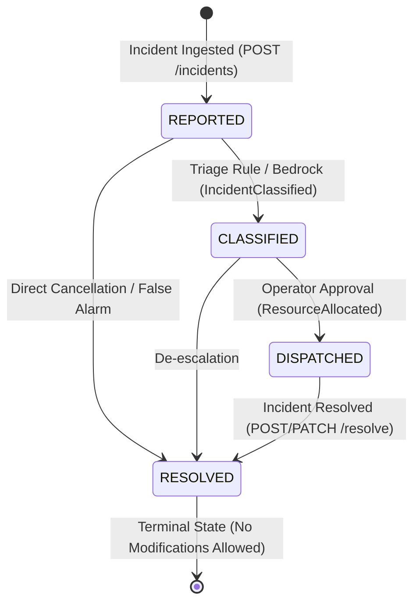

# ResQFlow — Amazon DynamoDB Database Design & Consistency Model

> **Primary Table:** `ResQFlowIncidents`  
> **Region:** AWS `ap-south-2` (Hyderabad)  
> **Billing Mode:** `PAY_PER_REQUEST` (On-Demand Capacity)  
> **Point-In-Time Recovery (PITR):** Supported  
> **Encryption:** AWS Owned Key (Encrypted at rest by default)

---

## 1. Table Schema & Key Design

The `ResQFlowIncidents` table stores the authoritative, operational state for all emergency incidents.

| Attribute | DynamoDB Type | Key Role | Description | Example |
|---|---|---|---|---|
| `incidentId` | `S` (String) | **Partition Key (PK)** | Unique incident identifier | `INC-7F89B2` |
| `status` | `S` (String) | **GSI Partition Key** | Operational lifecycle stage | `REPORTED`, `CLASSIFIED`, `DISPATCHED`, `RESOLVED` |
| `createdAt` | `S` (String) | **GSI Sort Key (SK)** | ISO 8601 UTC creation timestamp | `2026-10-01T08:30:00.000Z` |
| `updatedAt` | `S` (String) | Attribute | ISO 8601 UTC update timestamp | `2026-10-01T08:30:02.140Z` |
| `resolvedAt` | `S` (String) | Attribute | ISO 8601 UTC resolution timestamp | `2026-10-01T08:45:12.300Z` |
| `type` | `S` (String) | Attribute | Incident category | `FIRE`, `MEDICAL`, `ACCIDENT`, `FLOOD`, `EARTHQUAKE`, `OTHER` |
| `severity` | `S` (String) | Attribute | Triage severity rating | `CRITICAL`, `HIGH`, `MEDIUM`, `LOW`, `UNKNOWN` |
| `description` | `S` (String) | Attribute | Incident narrative | Structure fire report |
| `peopleAffected` | `N` (Number) | Attribute | Casualty / impacted headcount | `15` |
| `location` | `M` (Map) | Attribute | Coordinates `{latitude, longitude}` | `{"latitude": 17.4399, "longitude": 78.4983}` |
| `latitude` | `N` (Number) | Attribute | Decimal latitude for indexed spatial queries | `17.4399` |
| `longitude` | `N` (Number) | Attribute | Decimal longitude for indexed spatial queries | `78.4983` |
| `assignedTeam` | `S` (String) | Attribute | Designated emergency tactical team | `ERT-Hyderabad-Alpha` |
| `hospital` | `S` (String) | Attribute | Designated trauma facility | `Apollo Emergency & Trauma Care` |
| `etaMinutes` | `N` (Number) | Attribute | Straight-line Haversine travel estimate | `8` |
| `version` | `N` (Number) | Attribute | Optimistic locking concurrency control | `1`, `2`, `3` |
| `lastEventId` | `S` (String) | Attribute | Idempotency correlation key | `INC-7F89B2:IncidentReported:1` |
| `isSimulation` | `BOOL` (Boolean) | Attribute | Explicit demo fixture flag | `true` |
| `resolutionNotes`| `S` (String) | Attribute | Optional operator stabilization notes | `Cleared by Unit Alpha` |
| `operatorId` | `S` (String) | Attribute | Approving dispatcher identifier | `DISP-HYD-01` |

---

## 2. Global Secondary Indexes (GSI)

### Index: `StatusCreatedAtIndex`
- **Partition Key:** `status` (`S`)
- **Sort Key:** `createdAt` (`S`)
- **Projection:** `ALL`
- **Purpose:** Enables high-performance, bounded queries for all active or resolved incidents ordered chronologically, without executing costly full-table `Scan` operations:
  ```python
  table.query(
      IndexName="StatusCreatedAtIndex",
      KeyConditionExpression=Key("status").eq("DISPATCHED") & Key("createdAt").gte("2026-10-01T00:00:00Z"),
      ScanIndexForward=False, # Newest first
      Limit=50
  )
  ```

---

## 3. Incident Lifecycle State Machine



### State Transition Validation Table
| Current Status | Allowed Next Statuses | Guard Conditions |
|---|---|---|
| `REPORTED` | `CLASSIFIED`, `RESOLVED` | Initial record validated; idempotency key recorded. |
| `CLASSIFIED` | `DISPATCHED`, `RESOLVED` | Severity rated; resource recommendations computed. |
| `DISPATCHED` | `RESOLVED` | Tactical unit confirmed; alerts broadcast to SNS/SQS. |
| `RESOLVED` | *(None — Terminal)* | Cannot be modified, reopened, or re-dispatched. |

---

## 4. Concurrency Protection & Idempotency

### 4.1 Optimistic Concurrency Control (OCC)
To prevent race conditions when simultaneous updates arrive from automated Step Functions workflows and human dispatchers, all status and field modifications enforce a conditional write check on the `version` attribute:

```python
table.update_item(
    Key={"incidentId": incident_id},
    UpdateExpression="SET #status = :new_status, #version = #version + :inc, updatedAt = :now",
    ConditionExpression="attribute_exists(incidentId) AND #version = :expected_version",
    ExpressionAttributeNames={
        "#status": "status",
        "#version": "version"
    },
    ExpressionAttributeValues={
        ":new_status": "DISPATCHED",
        ":expected_version": current_version,
        ":inc": 1,
        ":now": datetime.now(timezone.utc).isoformat()
    }
)
```
If two processes attempt to modify the record simultaneously, DynamoDB raises a `ConditionalCheckFailedException`, rejecting the stale update safely with HTTP 409 Conflict.

### 4.2 Idempotent Event Publishing
The ingestion Lambda performs a **persist-before-publish** sequence:
1. Incident is written to DynamoDB with conditional check `attribute_not_exists(incidentId)`.
2. EventBridge `PutEvents` is executed with correlation ID and idempotency key.
3. If `PutEvents` fails, an alert is logged with the incident ID and the record remains intact for retry.
4. Downstream Step Functions workflows check whether an incident is already processed before triggering duplicate resource allocation.
