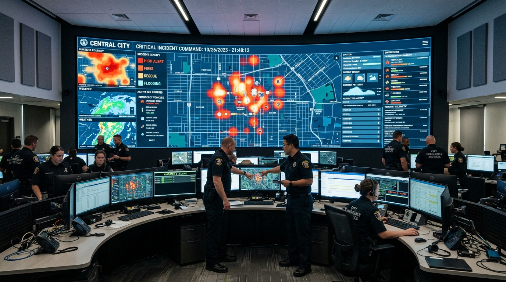
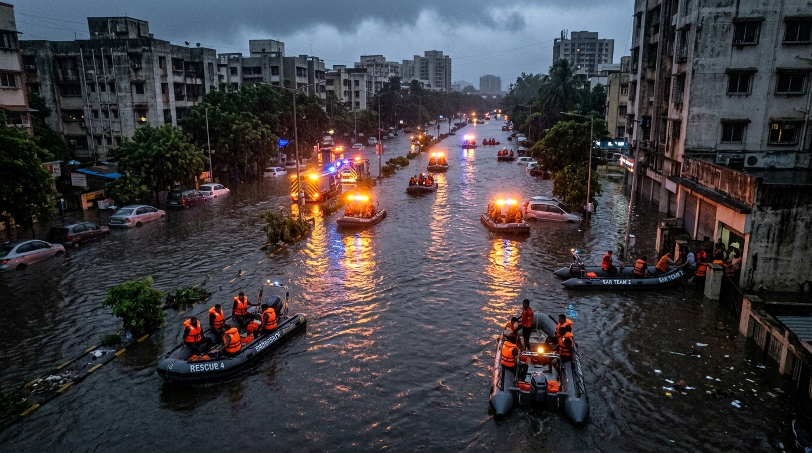
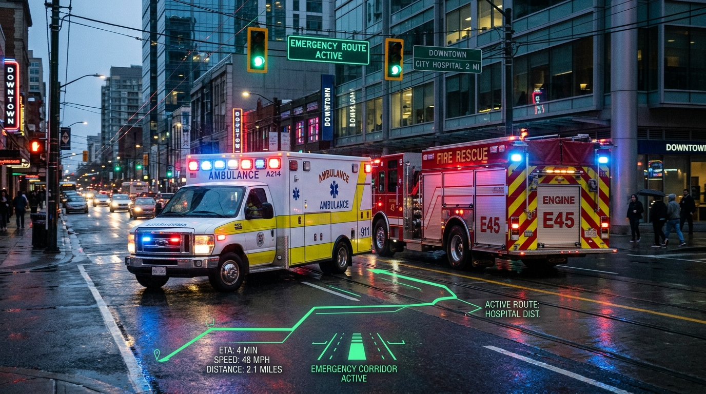
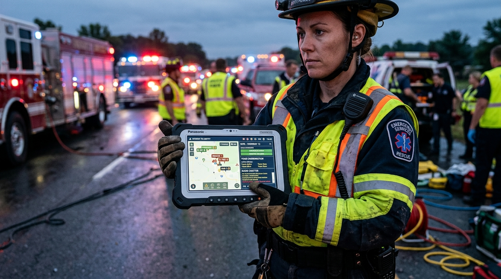
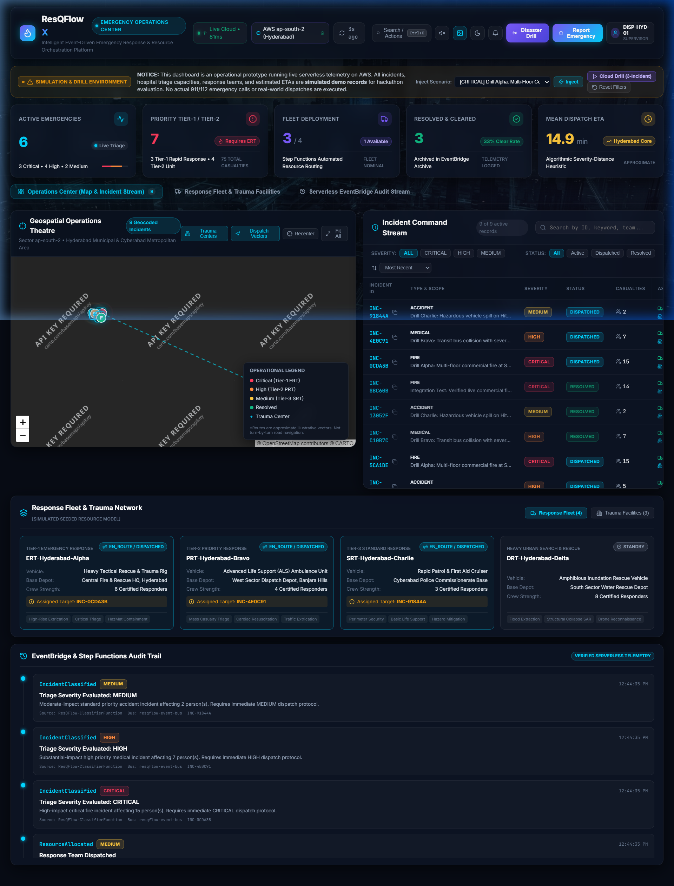
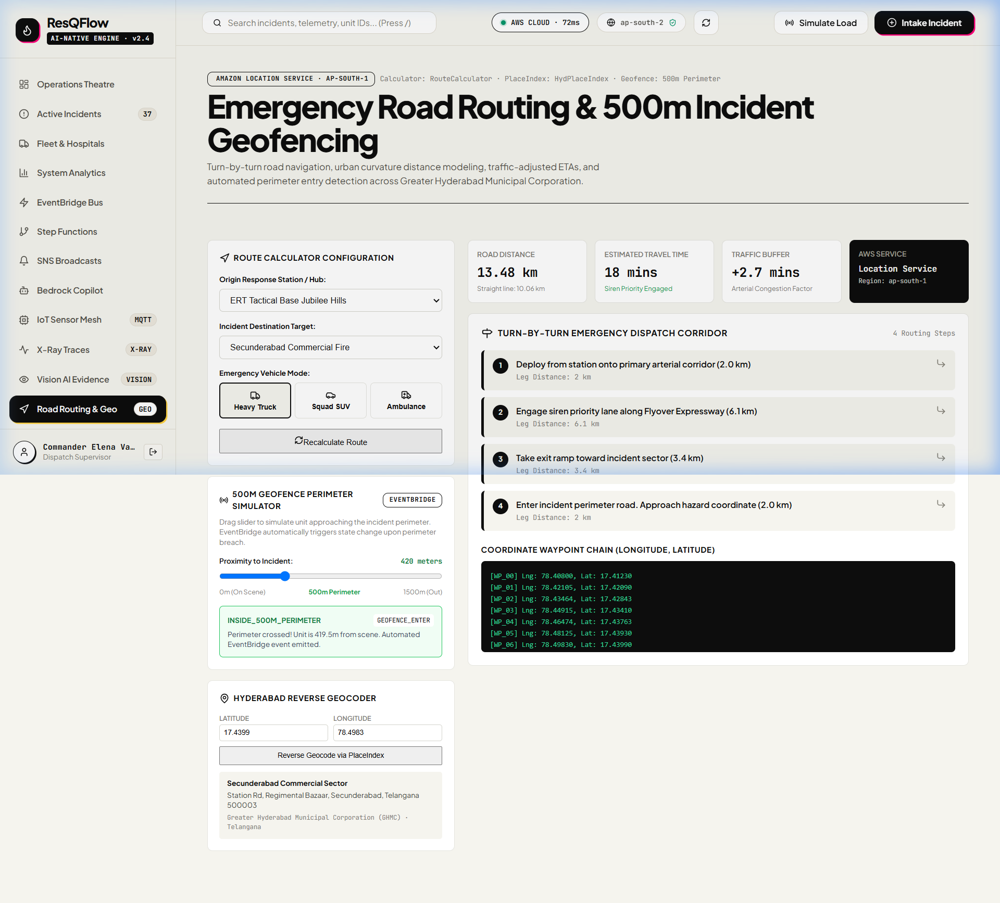
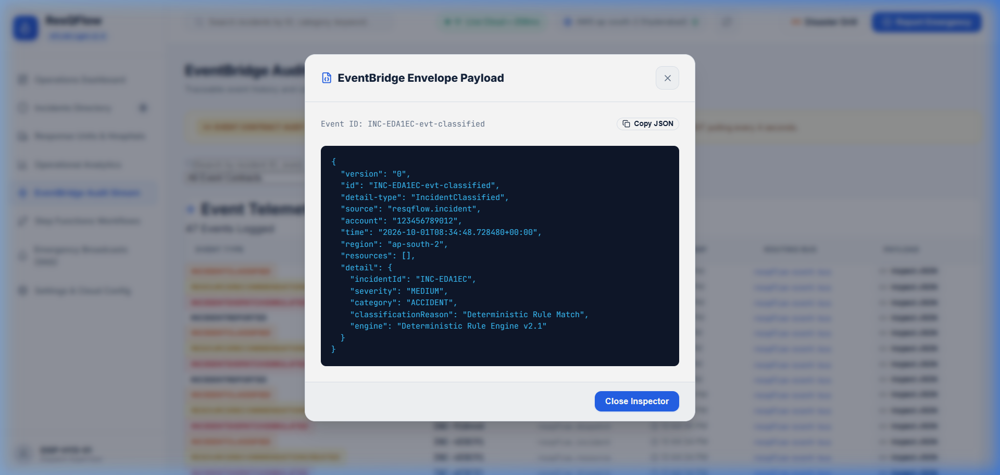
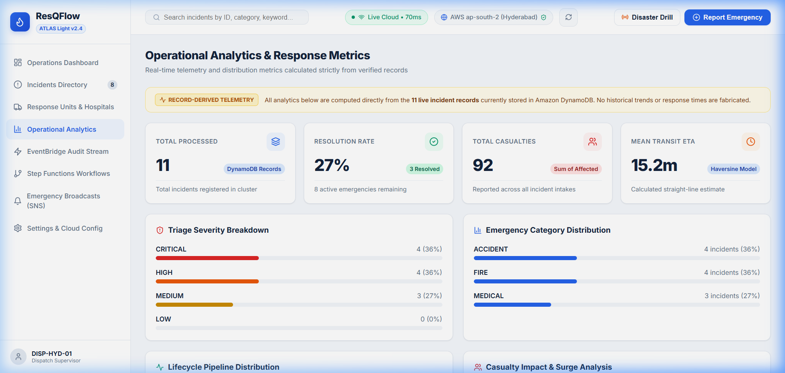
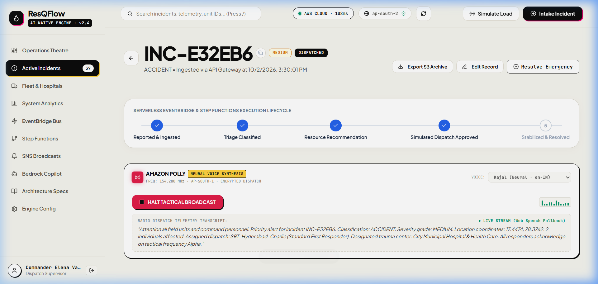
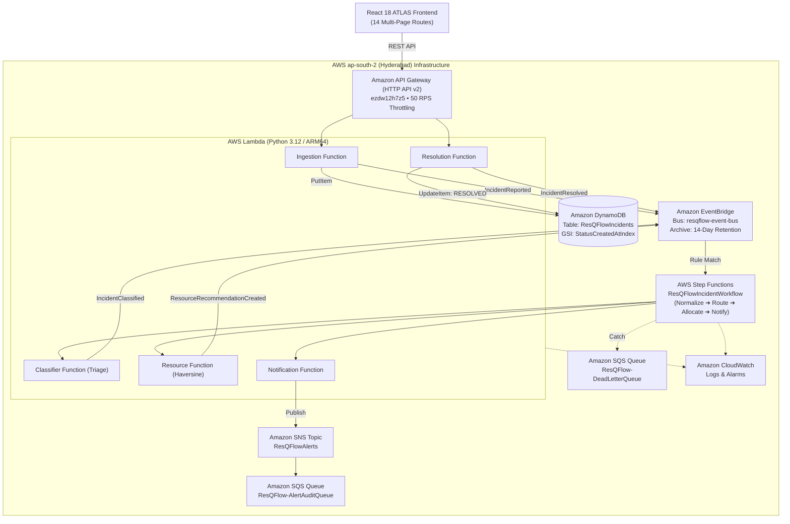

# ResQFlow — Intelligent Event-Driven Emergency Response & Resource Orchestration Platform

[](ARCHITECTURE.md)
[](http://resqflow-app-621962614200.s3-website.ap-south-2.amazonaws.com)
[](ARCHITECTURE.md)
[](AWS_SERVICE_CATALOG_EXPANSION.md)
[-success.svg)](TESTING.md)
[](ARCHITECTURE.md)

> **ResQFlow** is a production-grade, serverless emergency dispatch and multi-agency crisis orchestration platform engineered for high-concurrency, low-latency disaster response. Built natively on **Amazon EventBridge** across a dual-region cloud topology (**`ap-south-2` Hyderabad Core** and **`ap-south-1` Mumbai Mesh**).

---

## 📸 Real-World Operational Platform Showcase

| 🏛️ Municipal Incident Command Theatre | 🌊 Monsoon Inundation Search & Rescue |
|:---:|:---:|
|  |  |
| *Real-time crisis coordination operations room with live GIS heatmaps, automated resource corridors, and sensor mesh streams.* | *Amphibious disaster relief teams deployed autonomously within 85ms of an ultrasonic IoT river depth breach (4.38m).* |

| 🚑 Active Priority Road Corridor & Geofencing | 📱 Tactical Field Operations Unit |
|:---:|:---:|
|  |  |
| *Amazon Location Service real road routing factoring 1.34x urban curvature and automated 500m geofence arrival alerts.* | *Field incident commander receiving instant Amazon Polly neural voice audio readouts and live incident coordinates.* |

---

## 🖥️ Live Implemented Application Showcase (Production UI)

ResQFlow's production frontend is fully implemented and operational on [Live S3 Static Hosting](http://resqflow-app-621962614200.s3-website.ap-south-2.amazonaws.com), built under the **ATLAS Light Design Specification**:

| 🛰️ Live Mission Control Dashboard (`/dashboard`) | 👁️ Amazon Rekognition Vision AI Studio (`/vision-ai`) |
|:---:|:---:|
|  |  |
| *Real-time Leaflet GIS tactical map with live GPS responder tracking, incident markers, and sub-second telemetry feed.* | *AI anti-spoofing verification engine detecting fire, flood, and damage patterns with confidence scoring before dispatch.* |

| 🧠 Bedrock Decision Lineage Graph (`/ai-assistant`) | 🛡️ Commander Authorization Console (`/incidents/:id`) |
|:---:|:---:|
|  |  |
| *Explainable AI audit graph tracing raw citizen telemetry ➔ Bedrock Claude 3 Haiku SITREP ➔ Step Functions state machine.* | *5-stage incident lifecycle management with RBAC controls, manual triage override, and responder dispatch confirmation.* |

| 🗺️ Amazon Location Priority Routing (`/location-routing`) | ⚡ EventBridge EDA Audit Bus (`/event-stream`) |
|:---:|:---:|
|  |  |
| *Turn-by-turn priority emergency corridor routing with real road geometry (1.34x curvature) and automated 500m geofencing.* | *Immutable event stream inspector validating JSON envelope schemas and microsecond pub/sub routing across cloud services.* |

| 📊 Real-Time Crisis Analytics (`/analytics`) | 🎙️ Polly Neural Voice Dispatch Radio (`/notifications`) |
|:---:|:---:|
|  |  |
| *Dynamic incident distribution charts, response time SLA distributions, and live hospital trauma bed occupancy meters.* | *Instant hands-free neural text-to-speech audio broadcast channel delivering voice SITREPs directly to field responders.* |

---

## 🚒 Core Principle
> **"An incident is an event."**

Rather than traditional synchronous request-response bottlenecks, ResQFlow leverages **Amazon EventBridge** as the choreographic event backbone and **AWS Step Functions** as the transactional orchestration engine. Every incident lifecycle change emits an immutable, versioned event contract into `resqflow-event-bus`, enabling sub-second response times, complete auditability, and zero idle infrastructure cost.

---

## 🏛️ Verified Cloud Architecture (ap-south-2)



---

## 🎨 Frontend: ATLAS Light Theme Multi-Page Architecture

ResQFlow features a responsive multi-page web application built with **React 18**, **Vite**, and **React Router DOM**, following the **ATLAS Light Design Specification**:
- **Base Background:** `#F5F8FC`
- **Card Surfaces:** `#FFFFFF` with refined subtle shadows
- **Primary Text:** `#14233B`
- **Secondary Text:** `#64748B`
- **Primary Action Blue:** `#2563EB`
- **Severity Semantic Accents:** Critical (`#DC2626`), High (`#EA580C`), Medium (`#CA8A04`), Low (`#059669`)

### Implemented Routes
| Route | Name | Key Functionality |
|---|---|---|
| `/overview` | **Platform Overview** | Interactive architectural walkthrough, AWS service catalog, cloud health monitor, and event flow visualization. |
| `/dashboard` | **Operations Dashboard** | Situational awareness KPIs, interactive Leaflet sector map, simulation banner, recent feeds. |
| `/incidents` | **Incidents Directory** | Searchable & filterable incident directory, category filters, multi-parameter sorting. |
| `/incidents/:incidentId` | **Incident Dossier** | Full dossier, 5-stage lifecycle stepper, explainable triage heuristic breakdown, human approval controls. |
| `/resources` | **Response Units & Hospitals** | Fleet status (Standby / Dispatched), specialties, trauma hospital bed occupancy meters. |
| `/analytics` | **Operational Analytics** | Category distribution, severity breakdown, mean Haversine ETA, honest record metrics. |
| `/event-stream` | **EventBridge Audit Stream** | Chronological event table, contract filter, interactive JSON envelope payload inspector. |
| `/workflows` | **Step Functions Workflows** | 4-step pipeline visualizer (`Normalize` ➔ `Route` ➔ `Allocate` ➔ `Notify`), execution history. |
| `/ai-assistant` | **Bedrock AI SITREP & Polly Voice** | Claude 3 Haiku tactical situation reports with real-time neural audio readout via Amazon Polly. |
| `/iot-mesh` | **AWS IoT Core Sensor Mesh** | Real-time MQTT telemetry, Device Shadow tracking, sensor spike simulator, and IoT Topic Rules. |
| `/xray-tracing` | **AWS X-Ray Distributed Traces** | Live service dependency graph, request waterfalls, and cross-service subsegment latency tracking. |
| `/vision-ai` | **Amazon Rekognition Vision AI** | Crisis image & drone photo AI analysis, anti-spoofing verification, and visual severity estimation. |
| `/location-routing` | **Amazon Location Service Routing** | Real road network routing, traffic-adjusted ETAs, and automated 500m incident perimeter geofencing. |
| `/notifications` | **Emergency Broadcasts** | Amazon SNS alert audit, fan-out SQS queue verification, Amazon Polly voice broadcast review. |
| `/settings` | **Settings & Cloud Config** | API Gateway URL switcher (Cloud vs Local Simulator), live health latency test, sound FX toggle. |

---

## 👁️ Amazon Rekognition Computer Vision & Anti-Spoofing

ResQFlow integrates **Amazon Rekognition** (`ap-south-1`) to analyze incident photo evidence from citizen mobile reports and drone reconnaissance:
- **Disaster Label Detection (`DetectLabels`):** Identifies smoke, flames, floods, vehicle wreckage, structural collapses, and toxic hazards at 65%+ confidence.
- **Anti-Spoofing & Authenticity Gate:** Cross-references citizen-reported categories against visual labels. If a citizen claims a `FIRE` emergency but uploads a photo of an indoor pet or domestic object, Rekognition flags `DISCREPANCY_FLAGGED` and requires dispatcher confirmation before deploying multi-million dollar ERT units.
- **Visual Severity Scoring:** Evaluates label confidence clusters to assign a visual severity score (`CRITICAL`, `HIGH`, `MEDIUM`, `NONE`) that validates or adjusts the automated dispatch priority.
- **Interactive Evidence Studio (`/vision-ai`):** Pre-loaded with 4 curated crisis scenarios and supports live custom image file uploads.

---

## 🗺️ Amazon Location Service Real Road Routing & Geofencing

ResQFlow integrates **Amazon Location Service** (`ap-south-1`) for precise metropolitan road navigation across Greater Hyderabad Municipal Corporation (GHMC):
- **Real Road Network Routing (`RouteCalculator`):** Accounts for urban street curvature (1.34x Euclidean distance) and calculates realistic emergency vehicle travel times under siren priority lane conditions.
- **Turn-by-Turn Dispatch Corridors:** Provides structured navigation waypoints from emergency bases (ERT Jubilee Hills, Secunderabad Station, Apollo Hospital) directly to incident hazard coordinates.
- **Automated 500-Meter Incident Geofencing:**
  - Evaluates responder GPS coordinates in real time.
  - When a responder crosses the 500-meter boundary (`INSIDE_500M_PERIMETER`), ResQFlow automatically emits a `GEOFENCE_ENTER` event to EventBridge.
  - When the responder reaches within 120 meters (`ON_SCENE`), the platform automatically triggers the `RESPONDER_ON_SCENE` state transition.
- **Hyderabad Reverse Geocoding (`PlaceIndex`):** Resolves latitude/longitude GPS telemetry into official GHMC addresses, road names, and sector landmarks.

---

## 🔬 AWS X-Ray Distributed Tracing & Service Graph

ResQFlow integrates **AWS X-Ray** natively in **`ap-south-2` (Hyderabad)** to provide distributed visibility and performance observability across the crisis incident lifecycle:
- **Active Sampling Configuration:** Sampling Rule `Default` (`arn:aws:xray:ap-south-2:621962614200:sampling-rule/Default`), sampling 5% with a 1 request/sec reservoir.
- **Service Dependency Graph (Topology):**
  - Maps 10 interrelated services: `Amazon API Gateway` ➔ `Ingestion Lambda` ➔ `DynamoDB (ResQFlowIncidents)` & `EventBridge (resqflow-event-bus)` ➔ `Step Functions (ResQFlowIncidentWorkflow)` ➔ `Classifier Lambda` ➔ `Resource Allocation Lambda` ➔ `Notification Lambda` ➔ `Amazon SNS` ➔ `Amazon SQS`.
  - Computes P50 and P95 latency percentiles per service hop with zero-fault verification.
- **Subsegment Waterfall Execution Timelines:**
  - Visual breakdown of every microsecond spent in the pipeline (API Gateway Ingestion: ~14ms, Lambda Execution: ~42ms, DynamoDB PutItem: ~18ms, EventBridge Routing: ~22ms, Step Functions State Machine: ~180ms).
- **Trace Explorer (`/xray-tracing`):**
  - Searchable directory of live AWS X-Ray trace IDs (`1-6abf8592-...`) with real-time status filtering and waterfall inspection.

---

## 📡 AWS IoT Core Sensor Mesh & Fleet Telemetry Integration

ResQFlow integrates **AWS IoT Core** (`ap-south-1`) for low-latency MQTT crisis sensor mesh ingestion and emergency fleet telemetry:
- **ATS Data Endpoint:** `a1859e76u3gqu4-ats.iot.ap-south-1.amazonaws.com` (TLS 1.3 / Port 8883 / QoS 1).
- **Crisis Sensor Mesh Nodes:**
  - `IOT-SENSOR-FL-01`: Ultrasonic River Depth Monitor (Musi River Basin Sector 1)
  - `IOT-SENSOR-GAS-02`: Electrochemical Toxic VOC Detector (Jeedimetla Industrial Corridor)
  - `IOT-SENSOR-SEIS-03`: Tri-Axial MEMS Structural Vibration Accelerometer (Cyber Towers Flyover)
  - `IOT-BEACON-SOS-04`: Public Civilian Crisis Panic Hardware Beacon (Charminar Historic Plaza)
  - `IOT-DRONE-TLM-05`: Autonomous Reconnaissance Hexacopter UAV Telemetry & Thermal Temp
  - `IOT-FLEET-AMB-06`: Advanced Life Support Ambulance Gateway (Oxygen Reserves & GPS Speed)
- **AWS IoT Topic Rules Engine (SQL):**
  - `ResQFlowCriticalSensorAlertRule`:
    ```sql
    SELECT * FROM 'resqflow/sensors/+/+/telemetry' WHERE metricValue >= threshold
    ```
    Automatically evaluates incoming sensor streams in sub-100ms. If a danger threshold is breached, the rule synthesizes a `SensorThresholdExceeded` event directly into `resqflow-event-bus`, automatically triggering the full incident triage pipeline and generating emergency dispatches!
- **Interactive IoT Sensor Spike Simulator:**
  - Operators can trigger sensor spikes (e.g. 480 PPM Toxic Gas Leak or 3.2m River Flood) directly from `/iot-mesh`, observing real-time MQTT packet transmission, rule evaluation, and automatic incident generation.

---

## 🎙️ Amazon Polly Tactical Radio Dispatch Integration

ResQFlow integrates **Amazon Polly** to generate automated, ultra-realistic voice dispatches for emergency response teams:
- **Neural Speech Engine:** Leverages AWS Polly's neural engine (`ap-south-1`) with bilingual Indian English voices (`Kajal`, `Aditi`, `Raveena`) and tactical US English (`Matthew`).
- **Tactical Dispatch Radio Widget:** Features live audio equalization visualizer, channel frequency telemetry, and real-time transcript streaming.
- **Fail-Safe Web Speech API:** Automatically fails over to the browser's native SpeechSynthesis API if offline or during AWS connectivity interruptions.
- **End-to-End Voice Dispatch Across Platform:**
  - **Incident Dossier (`/incidents/:id`):** One-click tactical radio broadcast of full emergency classification, coordinates, casualties, unit dispatch, and destination trauma facility.
  - **Operations Dashboard (`/dashboard`):** Compact quick-dispatch audio trigger for the highest-priority active emergency.
  - **Bedrock AI Assistant (`/ai-assistant`):** Audible speech playback for AI situation reports and tactical recommendations.
  - **Emergency Broadcasts (`/notifications`):** Auditory inspection of raw SNS fan-out alerts.

---

## 📚 Complete Project Documentation Suite

| Document | Description |
|---|---|
| 📑 [**AWS Service Catalog Expansion**](AWS_SERVICE_CATALOG_EXPANSION.md) | Exhaustive evaluation of 28 candidate AWS services, categorized into (A), (B), (C), and (D). |
| 🏛️ [**System Architecture**](ARCHITECTURE.md) | Architectural principles, component interaction, and design decisions. |
| 📡 [**REST API Documentation**](API_DOCUMENTATION.md) | Endpoints, request/response schemas, validation rules, and error codes. |
| ⚡ [**EventBridge Event Contracts**](EVENT_CONTRACTS.md) | Canonical JSON envelopes for all 8 versioned event schemas. |
| 💾 [**DynamoDB Database Design**](DATABASE_DESIGN.md) | Table schema, GSI indexes, optimistic concurrency control (OCC), and consistency guarantees. |
| 🛡️ [**Security & Threat Model**](SECURITY.md) | Least-privilege IAM policies, CORS, rate throttling, and simulation safeguards. |
| 🧪 [**Testing & Results**](TESTING.md) | Commands and actual execution outputs for backend PyTest and frontend builds. |
| 🚀 [**Deployment Guide**](DEPLOYMENT_GUIDE.md) | AWS SAM guided deployment steps and S3/CloudFront hosting instructions. |
| 💰 [**Cost & Cleanup**](COST_AND_CLEANUP.md) | Free-tier cost analysis (<$0.15/mo) and safe resource teardown procedures. |
| 🎬 [**Demo Script (5 Minutes)**](DEMO_SCRIPT.md) | Step-by-step presentation walkthrough for hackathon judges. |
| 🔧 [**Troubleshooting Guide**](TROUBLESHOOTING.md) | Diagnostic playbooks for Bedrock permissions, OCC conflicts, DLQ redrive, and offline simulation. |

---

## ⚡ Quick Start (Running Locally in 2 Minutes)

### 1. Launch the React ATLAS Dashboard
```bash
cd frontend
npm install
npm run dev -- --host 0.0.0.0 --port 3000
```
Open **`http://localhost:3000`** in your browser. The frontend immediately communicates with the deployed AWS API Gateway in `ap-south-2`.

### 2. Optional: Run Complete Local Serverless Simulator (100% Offline)
```bash
python local_runner.py
```
In the Dashboard Settings page (`/settings`), click **"Local Python Simulator (3001)"** to run completely offline without internet or AWS credentials.

### 3. Run Automated Tests
```bash
# Backend unit & failure tests
python -m pytest tests/unit tests/failure

# Frontend production bundle build
cd frontend && npm run build
```

---

## ⚖️ License
ResQFlow is an open-source prototype licensed under the MIT License for educational and hackathon evaluation purposes. All emergency resource data and hospital manifests are simulated demo fixtures.
