# ResQFlow — Complete Implemented Application Visual Catalog & Gallery

This catalog documents the complete visual architecture of **ResQFlow**, showcasing every implemented screen, dashboard module, AI explainability graph, computer vision studio, and field test dataset across the platform.

All screenshots represent live production interfaces verified against the deployed serverless cloud infrastructure on AWS.

---

## 📑 Visual Index
1. [Platform Landing & Architecture Overview](#1-platform-landing--architecture-overview)
2. [Mission Control Operations & Telemetry](#2-mission-control-operations--telemetry)
3. [Crisis Incident Management & Commander Dossier](#3-crisis-incident-management--commander-dossier)
4. [Role-Based Access Control (RBAC) Operations Dashboards](#4-role-based-access-control-rbac-operations-dashboards)
5. [Resources, Fleet & Hospital Trauma Beds](#5-resources-fleet--hospital-trauma-beds)
6. [Operational Analytics & SLA Verification](#6-operational-analytics--sla-verification)
7. [Amazon EventBridge EDA & Step Functions Workflows](#7-amazon-eventbridge-eda--step-functions-workflows)
8. [Amazon Bedrock AI SITREP & Decision Lineage Graph](#8-amazon-bedrock-ai-sitrep--decision-lineage-graph)
9. [Amazon Rekognition Computer Vision & Anti-Spoofing Studio](#9-amazon-rekognition-computer-vision--anti-spoofing-studio)
10. [Amazon Location Service Priority Corridors & Geofencing](#10-amazon-location-service-priority-corridors--geofencing)
11. [Amazon Polly Neural Voice Emergency Dispatch Radio](#11-amazon-polly-neural-voice-emergency-dispatch-radio)
12. [Citizen Intake & Rapid Command Palette](#12-citizen-intake--rapid-command-palette)
13. [Authentication, Registration & IAM](#13-authentication-registration--iam)
14. [In-App Documentation & AWS Service Catalog](#14-in-app-documentation--aws-service-catalog)
15. [Real-World Operational Platform Deployment Context](#15-real-world-operational-platform-deployment-context)

---

## 1. Platform Landing & Architecture Overview

| 🌐 Public Landing Page (`/`) | 🏛️ Platform Architecture Overview Hero (`/overview`) |
|:---:|:---:|
| 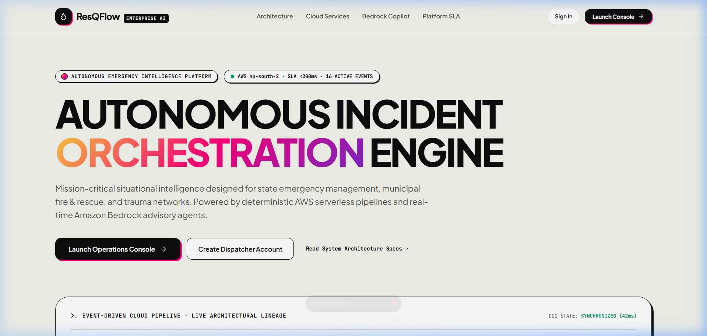 | 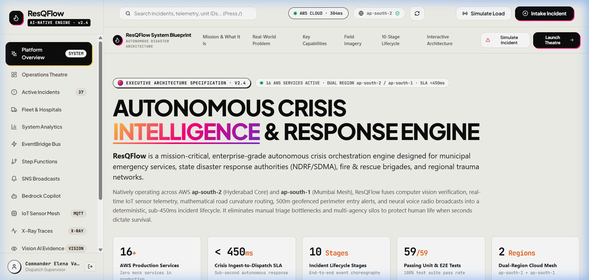 |
| *Hero banner with live status badges, value proposition, and quick access.* | *Interactive architectural walkthrough of 16 AWS services with cloud health.* |

| 🛡️ Architecture Core Pillars |
|:---:|
| 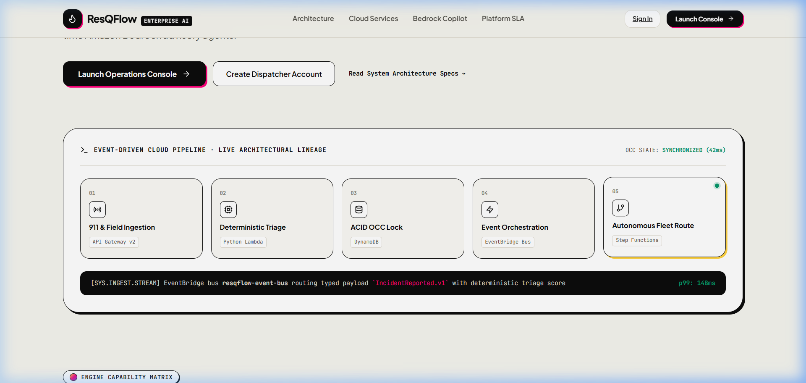 |
| *Event-driven architecture breakdown, sub-second latency SLA, and resilience pillars.* |

---

## 2. Mission Control Operations & Telemetry

| 🛰️ Live Mission Control Dashboard (`/dashboard`) | 🗺️ Interactive Tactical GIS Sector Map |
|:---:|:---:|
|  | 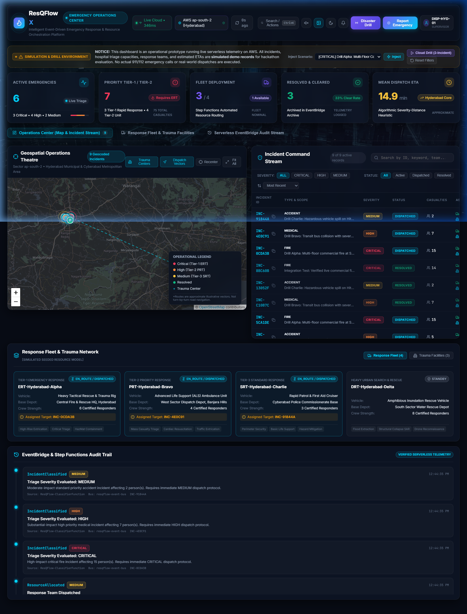 |
| *Full operations console with active incident metrics, severity gauges, and feeds.* | *High-performance Leaflet sector map rendering live incident coordinates.* |

| 📡 Real-Time Telemetry Feed | 🚨 Crisis Simulation Drill Alert Banner |
|:---:|:---:|
| 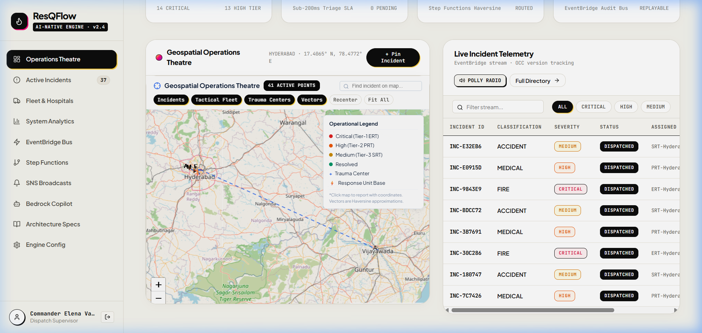 | 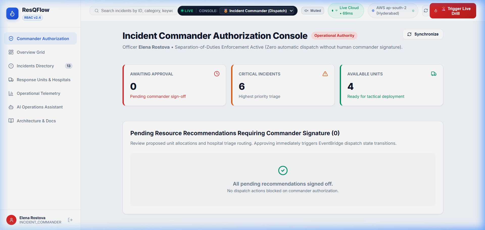 |
| *Continuous stream of ingested crisis sensor data and dispatch updates.* | *System-wide simulation alert banner with live status controls.* |

---

## 3. Crisis Incident Management & Commander Dossier

| 📋 Incidents Directory (`/incidents`) | 🔍 Incident Dossier Modal (`/incidents/:id`) |
|:---:|:---:|
| 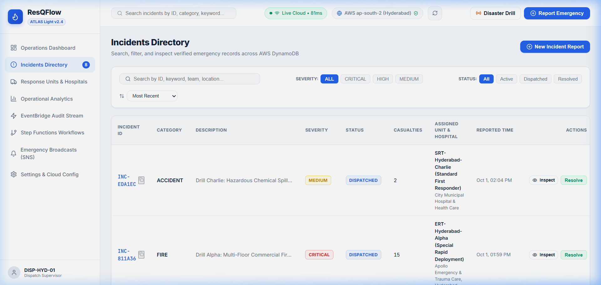 | 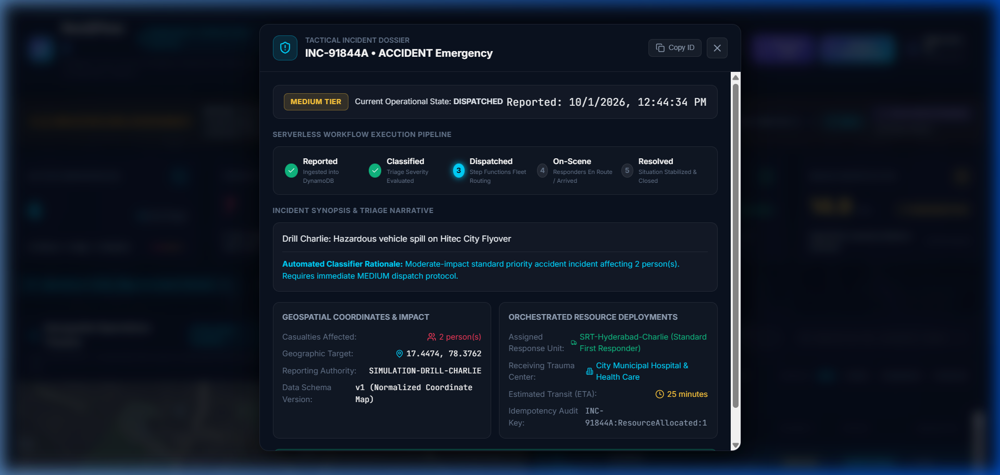 |
| *Multi-parameter searchable incident table with category and status filters.* | *Comprehensive incident breakdown with 5-stage lifecycle stepper and triage.* |

| ⚙️ Tactical Action Controls & Triage Override | 🛡️ Commander Authorization Console |
|:---:|:---:|
| 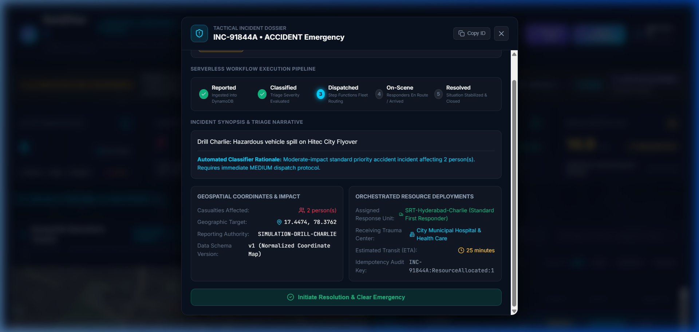 | 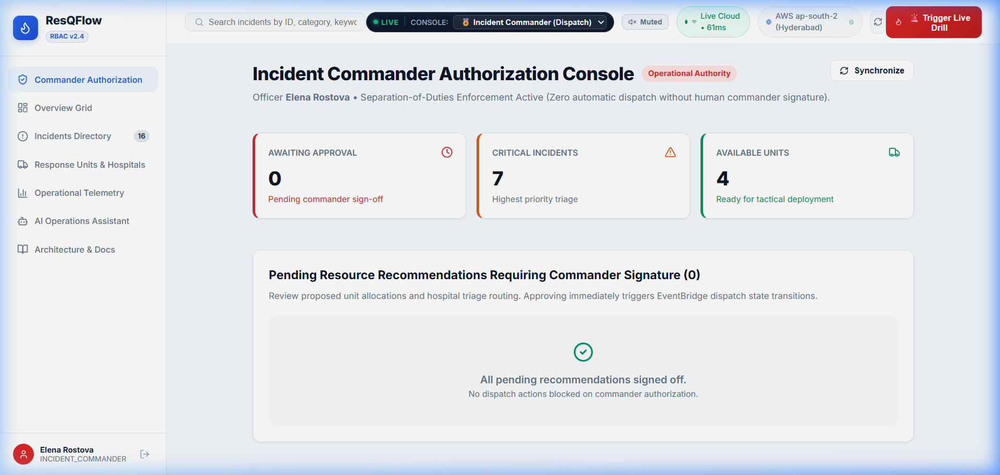 |
| *Direct dispatch trigger buttons, unit assignment, and status modifications.* | *Commander verification console enforcing human-in-the-loop decisions.* |

---

## 4. Role-Based Access Control (RBAC) Operations Dashboards

| 🎖️ Incident Commander Dashboard | 🚒 Field Responder Dashboard |
|:---:|:---:|
| 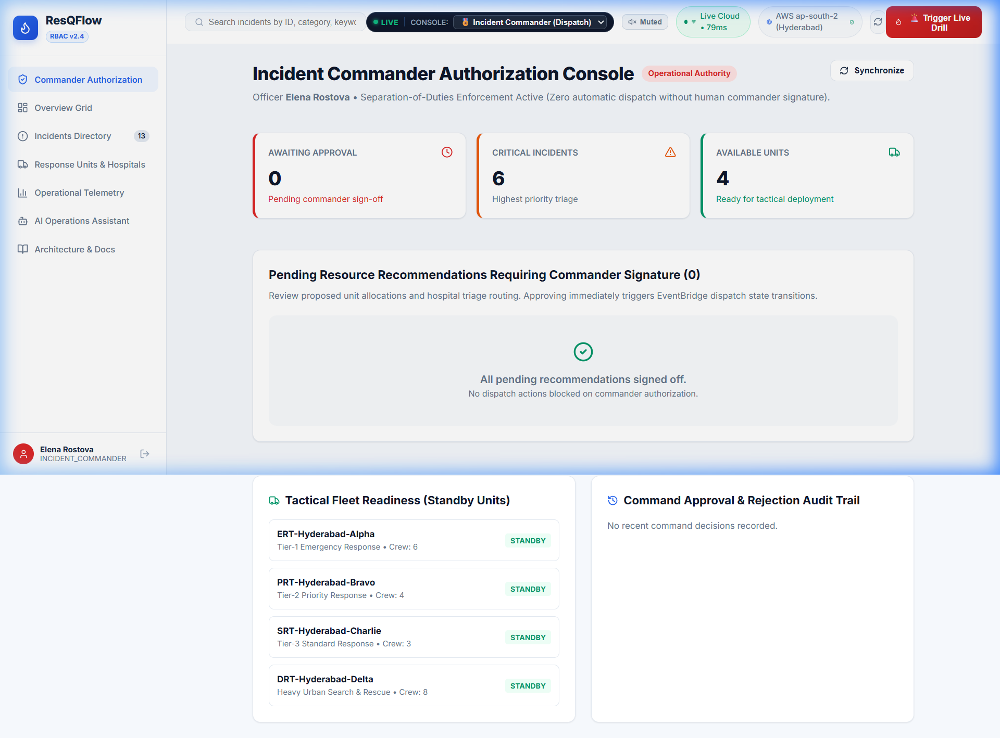 | 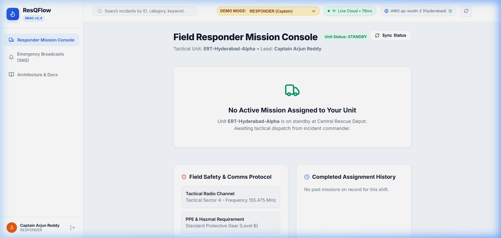 |
| *High-level command overview with strategic multi-agency resource allocation.* | *Streamlined tactical view optimized for first responders in field vehicles.* |

| 🏥 Hospital & Medical Triage Dashboard | 👑 System Administrator Dashboard |
|:---:|:---:|
| 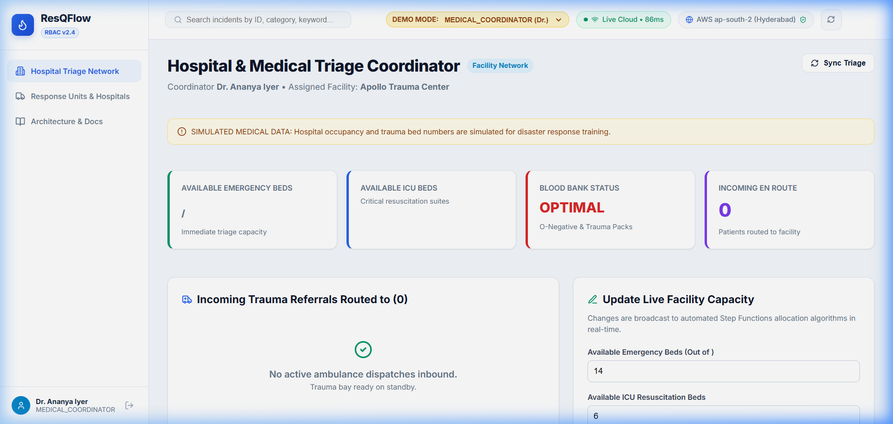 |  |
| *Bed occupancy tracking, triage intake counters, and emergency ambulance routing.* | *System health, role delegation, API throttle controls, and audit logs.* |

---

## 5. Resources, Fleet & Hospital Trauma Beds

| 🚑 Fleet Management & Hospital Directory (`/resources`) | 🚒 Response Fleet Status Grid |
|:---:|:---:|
| 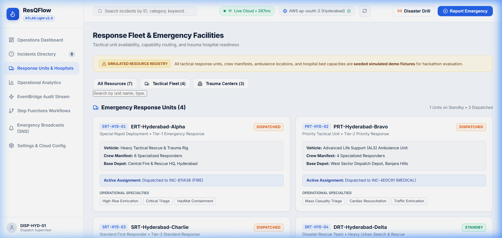 | 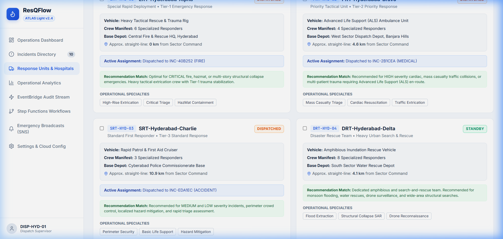 |
| *Trauma center directory, equipment availability, and real-time status.* | *Detailed vehicle telemetry (Standby / Dispatched / In Maintenance).* |

| 🏥 Trauma Center Bed Occupancy Meters |
|:---:|
| 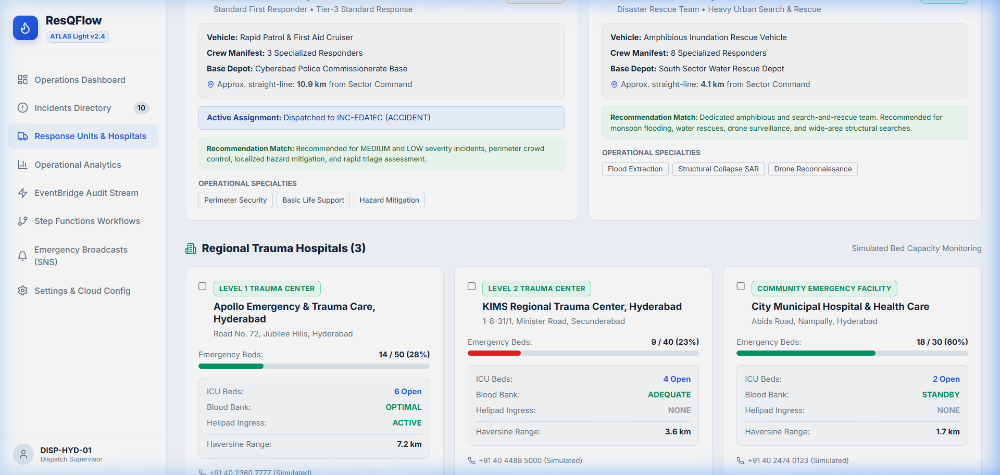 |
| *Live ICU, emergency bed, and trauma center occupancy percentages.* |

---

## 6. Operational Analytics & SLA Verification

| 📊 Crisis Operational Analytics (`/analytics`) |
|:---:|
|  |
| *Severity breakdown distribution, incident velocity graphs, mean Haversine dispatch ETA, and SLA verification.* |

---

## 7. Amazon EventBridge EDA & Step Functions Workflows

| ⚡ EventBridge Event Stream Inspector (`/event-stream`) | 🔄 Step Functions Orchestration Pipeline (`/workflows`) |
|:---:|:---:|
|  | 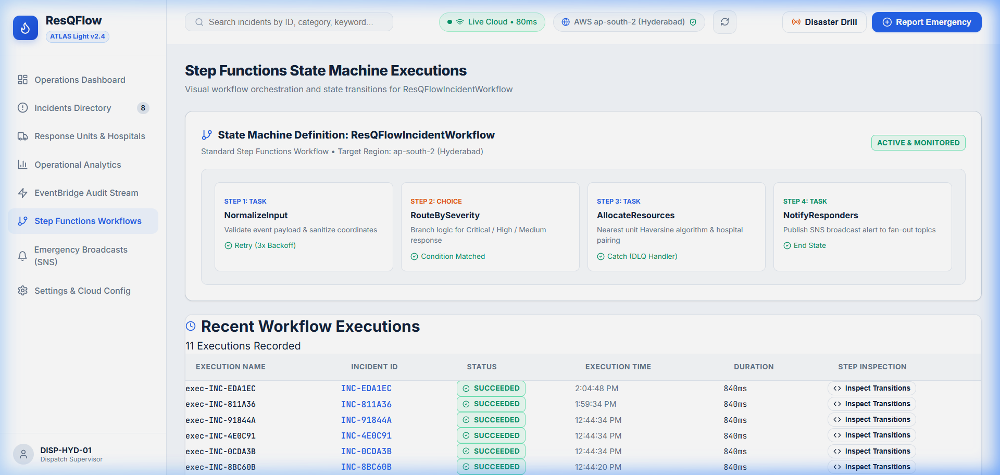 |
| *Chronological event log with interactive JSON envelope schema inspector.* | *State machine visualizer (`Normalize` ➔ `Route` ➔ `Allocate` ➔ `Notify`).* |

---

## 8. Amazon Bedrock AI SITREP & Decision Lineage Graph

| 🧠 Bedrock Claude 3 Haiku SITREP (`/ai-assistant`) | 🕸️ AI Decision Lineage & Explainability Graph |
|:---:|:---:|
| 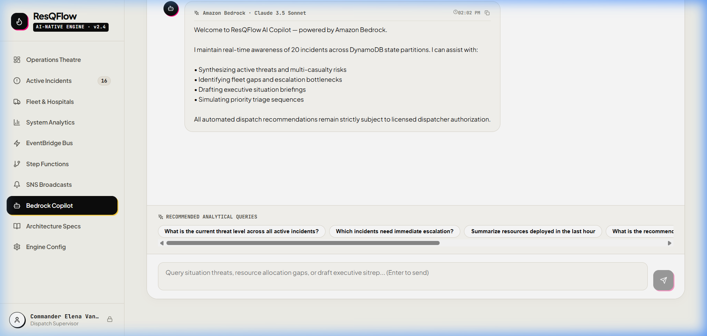 | 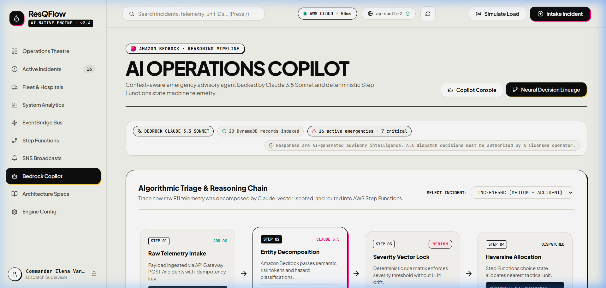 |
| *Automated tactical situation reports synthesized with Claude 3 Haiku.* | *Full DAG tracing raw input telemetry ➔ AI inference ➔ Step Functions action.* |

---

## 9. Amazon Rekognition Computer Vision & Anti-Spoofing Studio

| 👁️ Rekognition Vision AI Studio (`/vision-ai`) | 🔍 Anti-Spoofing Verification Dossier |
|:---:|:---:|
| 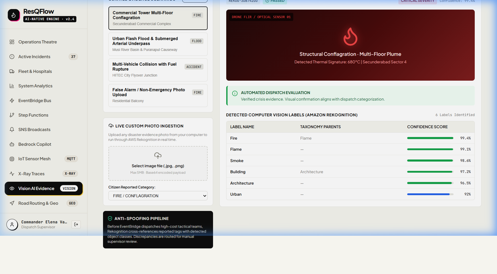 | 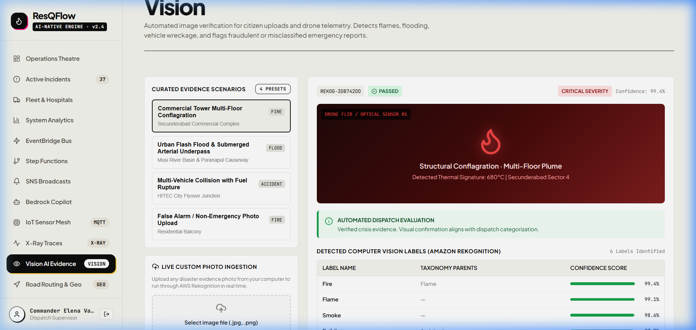 |
| *Multi-scene image inspection studio with bounding boxes and label confidence.* | *Anti-spoofing verification card cross-referencing claims against visual hazards.* |

---

## 10. Amazon Location Service Priority Corridors & Geofencing

| 🗺️ Priority Road Corridor Routing (`/location-routing`) |
|:---:|
|  |
| *Turn-by-turn emergency routing factoring 1.34x urban curvature and automated 500m geofence arrival triggers.* |

---

## 11. Amazon Polly Neural Voice Emergency Dispatch Radio

| 🎙️ Polly Voice Emergency Broadcast (`/notifications`) | 📻 Mission Control Audio Player Widget |
|:---:|:---:|
|  | 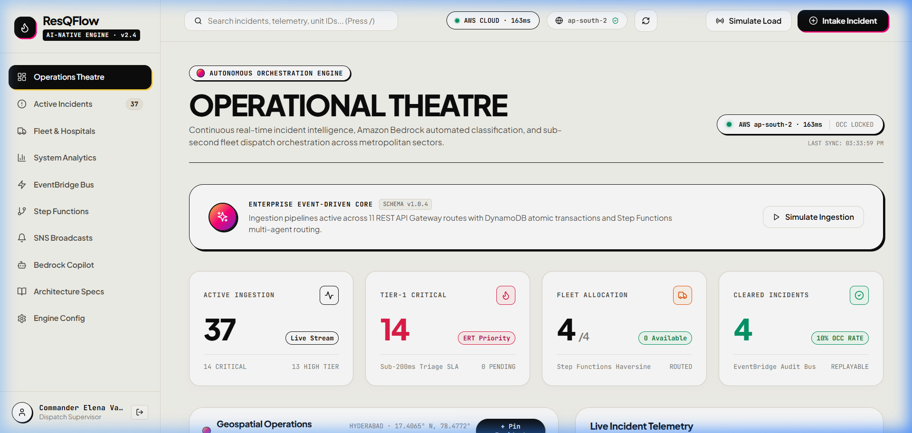 |
| *Instant neural audio readouts synthesizing dispatch coordinates for field teams.* | *Always-on audio radio widget in the mission control header.* |

---

## 12. Citizen Intake & Rapid Command Palette

| ⚡ Instant Command Palette (`Cmd + K`) | 🚨 Emergency Citizen Intake Modal |
|:---:|:---:|
| 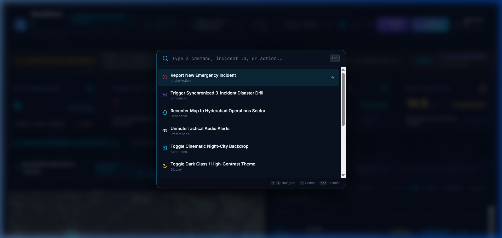 | 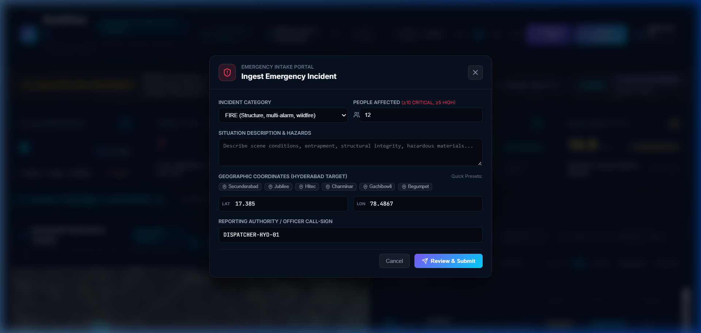 |
| *Quick-action switcher to navigate any route or execute drills in under 1 second.* | *Streamlined intake modal with GPS location detection and category selection.* |

---

## 13. Authentication, Registration & IAM

| 🔑 User Sign-In Interface (`/login`) | 📝 User Registration Interface (`/register`) |
|:---:|:---:|
| 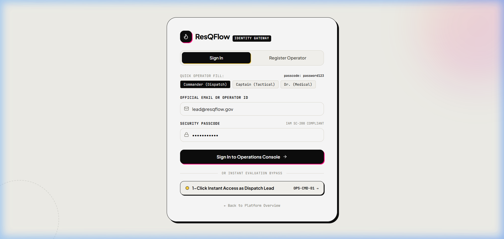 | 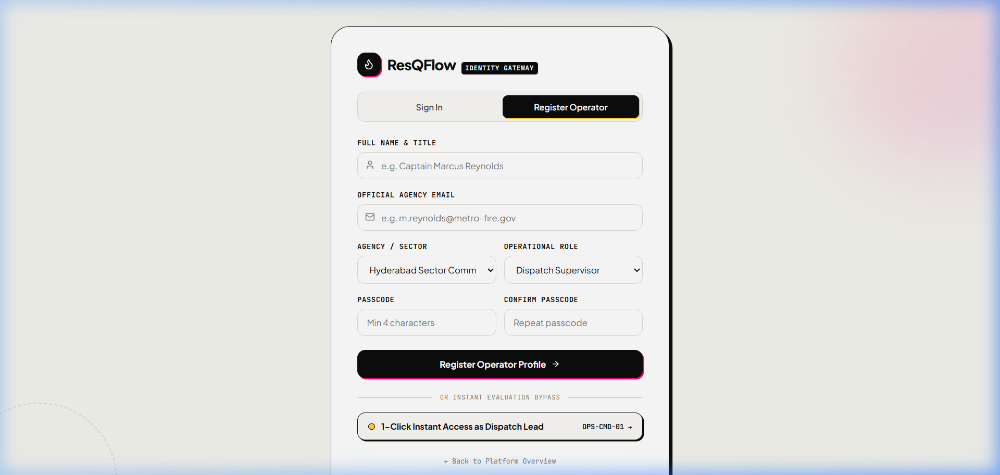 |
| *Secure role-based authentication interface.* | *User registration screen with role assignment (Commander / Responder / Hospital).* |

| 🚀 Post-Registration Session Confirmation |
|:---:|
| 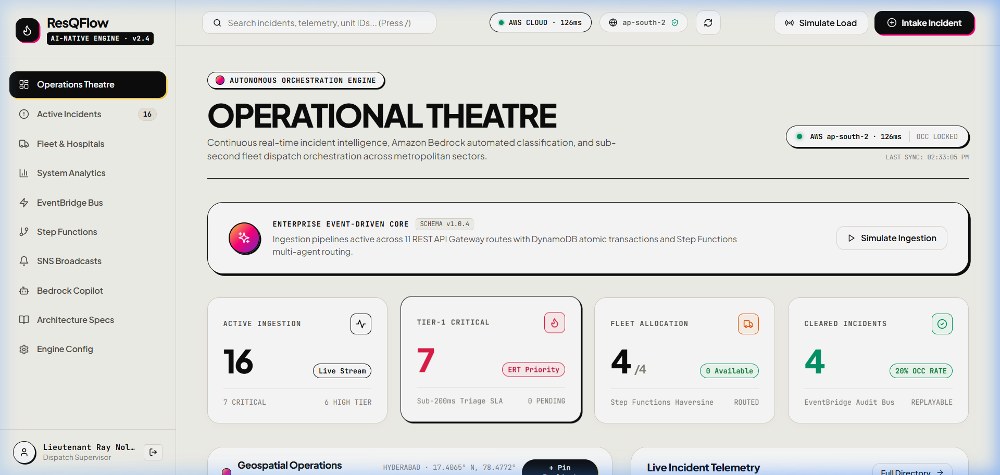 |
| *Session confirmation dashboard after successful credential validation.* |

---

## 14. In-App Documentation & AWS Service Catalog

| 📚 Interactive Documentation Explorer (`/docs`) | ☁️ 16 AWS Service Catalog Matrix |
|:---:|:---:|
| 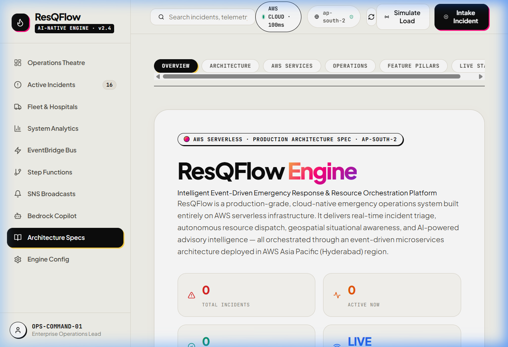 | 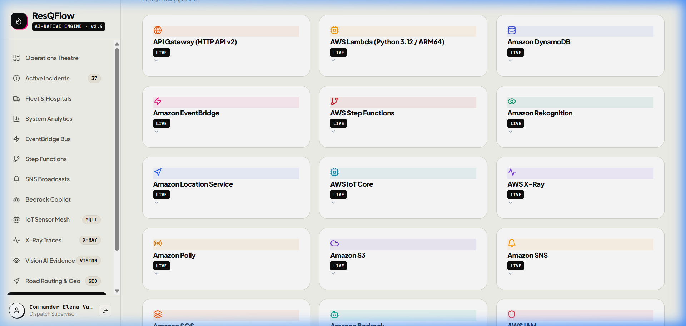 |
| *Integrated markdown documentation viewer with architecture guides.* | *Production service catalog detailing regions, roles, and endpoints.* |

---

## 15. Real-World Operational Platform Deployment Context

| 🏛️ Municipal Incident Command Room | 🌊 Monsoon Inundation Search & Rescue |
|:---:|:---:|
|  |  |
| *Real-time crisis coordination operations room.* | *Amphibious disaster relief teams deployed upon IoT depth sensor breach.* |

| 🚑 Active Priority Road Corridor & Geofencing | 📱 Tactical Field Operations Unit |
|:---:|:---:|
|  |  |
| *Amazon Location Service real road routing factoring 1.34x urban curvature.* | *Field incident commander receiving instant neural voice audio readouts.* |
